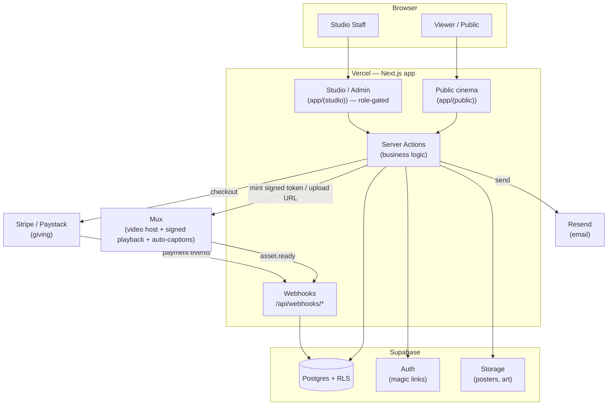
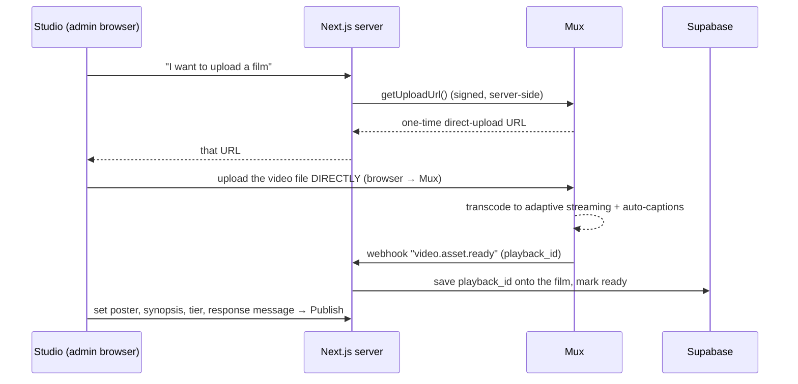
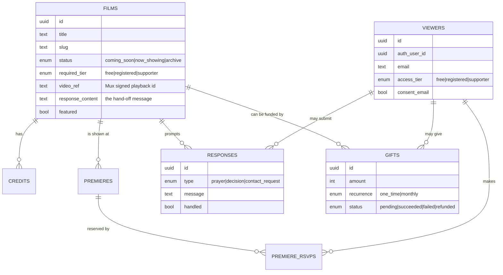

# Uriel Maforikan Productions — Platform Architecture

> **Audience for this document:** the ministry leadership (non-technical) *and*
> the engineers who build it. Part 1 is plain English. Later parts go deep.
> Tagline: **Evangelists who carry cameras. Light into dark.**

---

## Part 1 — What we are building, in plain English

### 1.1 The one-sentence version
We are building a **virtual cinema that doubles as an evangelism funnel**: people
come for the films, and the platform gently walks each viewer from *stranger* to
*audience member* to *viewer* to *someone who responds to God* to *partner who
funds the next film.*

### 1.2 Why this is not "just a streaming site"
Netflix wants you to keep watching forever. **We want the opposite** — we want
the film to *end well* and hand the viewer to a real person. The most important
screen in the whole platform is not the video player. It is the **moment the film
ends**, when we say: *"the lights are up — here is your next step."*

Everything else exists to get people to that moment, and to make sure a real
human follows up afterward.

### 1.3 The journey every visitor can take

```
  STRANGER ──▶ AUDIENCE ──▶ VIEWER ──▶ RESPONDER ──▶ PARTNER
   (browses)   (gives      (signs in   (asks for     (funds the
               email)       & watches)   prayer /      next film)
                                         decides for
                                         Christ)
```

| Stage | What the person does | What the platform does |
|-------|----------------------|------------------------|
| **Stranger** | Discovers a film (shared link, search, social) | Shows a cinematic, public film page — no barrier |
| **Audience** | Hands over an email to "join the audience" | Saves them, adds to mailing list, sends a welcome |
| **Viewer** | Signs in (one-click email link) and watches | Verifies who they are, unlocks the film securely |
| **Responder** | Film ends; asks for prayer, makes a decision, or asks to talk | Records it; alerts the pastoral team to follow up |
| **Partner** | Decides to fund the mission | Takes a secure gift, one-time or monthly |

### 1.4 The four "products" inside the platform

1. **The Cinema** (public) — the films, posters, trailers, and the watch experience.
2. **Premieres** (events) — a film "opens" at a set time so the whole audience
   watches together, like an opening night online.
3. **The Hand-off** (ministry) — the response after each film, and the inbox where
   a real team prays with and follows up every person.
4. **Partnership** (giving) — funding the next production.

### 1.5 The people who run it (roles)
A ministry is a team, not one person. The platform recognizes different jobs:

| Role | Can do | Cannot do |
|------|--------|-----------|
| **Owner** | Everything, incl. managing other staff | — |
| **Studio / Editor** | Upload & publish films, schedule premieres | See giving or pastoral data |
| **Pastoral team** | Read & respond to prayer/decision responses | Edit films or see finances |
| **Finance** | See gifts, reconcile, export receipts | See prayer requests |
| **Viewer** (the public) | Watch, respond, give | Anything in the admin |

> **Why this matters:** prayer requests and salvation decisions are deeply
> personal. The person handling money should not be browsing someone's
> confession, and vice-versa. Separating roles is both good security and good
> pastoral integrity. (See Part 6 — Privacy.)

---

## Part 2 — The big architectural decisions (and recommendations)

### 2.1 "Do we need a separate backend repo?"
**Short answer: No — and here is why, from an architect's chair.**

Your instinct ("separate the backend") is *correct as a principle* — concerns
should be separated. But the way to honor that principle here is **not** a second
codebase running a custom server. Here's the reasoning:

- **Supabase already _is_ your backend.** It is a managed Postgres database +
  authentication + file storage + auto-generated secure APIs + serverless
  functions. Building a separate Node/Express backend would mean *re-building
  things Supabase gives you for free*, plus paying to host and maintain it.
- **A separate repo for the admin** would duplicate your login system, your data
  types, and your design system, and double your deployments — for a team your
  size, that is friction without benefit.

**What we do instead — clear boundaries inside one well-structured codebase:**

| Concern | Where it lives | Isolation |
|---------|----------------|-----------|
| Public cinema | `app/(public)/…` | Public, no auth |
| Studio / Admin | `app/(studio)/…` | Behind auth + role checks |
| Business logic | `lib/` service layers | Shared, typed, tested |
| Data + rules | Supabase (Postgres + RLS) | The database enforces access |

The **database itself** (via Row Level Security) is the real "backend boundary" —
it refuses unauthorized reads/writes no matter what code calls it. That is
stronger than a separate server, because the rules live with the data.

### 2.2 When you _would_ split — and how
If the studio grows into a full content-management product, or a *different team*
owns it, the right move is a **monorepo** (one repository, multiple apps sharing
code) — **not** separate repositories.

```
Recommended future shape (only when needed):

  uriel-platform/                 ← one repo (a "monorepo")
  ├── apps/
  │   ├── web/                    ← the public cinema  (cinema.urielmaforikan.org)
  │   └── studio/                 ← the admin/CMS      (studio.urielmaforikan.org)
  ├── packages/
  │   ├── ui/                     ← shared design system
  │   ├── db/                     ← shared types + Supabase client
  │   └── services/               ← video, payments, email (shared)
  └── supabase/                   ← one schema, migrations, RLS
```

**Why monorepo, not two repos:** the public site and the studio must agree on the
*exact same* data shapes, security rules, and brand. In two separate repos they
drift apart and you get bugs at the seams. A monorepo lets them share one set of
types and one schema while deploying as two independent sites. Tooling: Turborepo
or Nx.

**Recommendation for today:** stay as **one Next.js app** with a clean
`(public)` / `(studio)` split (Phase 1 below). Graduate to the monorepo only when
the studio becomes a product of its own. Don't pay the complexity tax early.

### 2.3 The system at a glance



---

## Part 3 — The content pipeline (how films get in)

This is the part the question "how do we upload?" is really about. Films are
large; they must never pass through our own server. The flow:



**What the studio (admin) lets staff do:**
- **Upload a film** (direct to Mux) and watch processing status.
- **Upload poster & backdrop art** (to Supabase Storage).
- **Write** logline, synopsis, the all-important *response message*, set the
  **access tier** and **release date**.
- **Add cast & crew** with photos and bios.
- **Schedule a premiere** (pick the open time; the countdown + invites flow from it).
- **Review responses** (the pastoral inbox) — assign, mark handled, add notes.
- **See giving** (finance view) — totals, designations, export.

**Engineering note / current gap:** the build today has the *upload-URL minting*
(`getUploadUrl`) and the studio CRUD, but still needs the **Mux webhook
handler** (`/api/webhooks/mux`) that catches `video.asset.ready` and writes the
`playback_id` back onto the film. That is the missing link to make uploads
end-to-end. It's small and is the first item in Phase 2.

---

## Part 4 — Data model



Full DDL lives in `supabase/migrations/`. Every table has **Row Level Security**
on. The catalog is public to read; everything personal is locked to its owner or
to staff with the right role.

---

## Part 5 — Security model

**Two keys, two worlds:**
- The **anon (public) key** is *meant* to be public; it can only do what Row
  Level Security allows (read the catalog, write your own data).
- The **service-role key** bypasses all rules and lives **only on the server**.
  It never reaches a browser. It is what server actions and webhooks use.

**Gated video — why a leaked link is useless:**
Films use Mux's **signed playback policy**. The raw video ID does nothing on its
own. To watch, the *server* checks the viewer's tier and then mints a **short-
lived signed token** (4h). No token, no playback. You cannot share a working URL.

**Defense in depth:**
1. **Middleware** keeps sessions fresh and blocks the studio from anonymous users.
2. **Role checks** in the studio layout (and in the database via `is_admin()` /
   role functions).
3. **RLS** as the last line — the database refuses bad access even if app code is wrong.
4. **Webhook signature verification** on Stripe and Mux — we only trust events we
   can cryptographically confirm came from them.
5. **Secrets** live in environment variables, never in the repo (verified clean).

---

## Part 6 — Privacy & pastoral data (the part nobody asks about, but must)

> A viewer telling you *"I want to follow Jesus"* or *"please pray for my
> marriage"* is sharing **sensitive personal data** — under laws like GDPR,
> religious belief is a *special category* needing extra care. For a ministry,
> it is also a matter of trust and honor.

**Commitments the platform should make and enforce:**
- **Consent at the point of capture** — clear, opt-in, plain language. (Built into
  the audience and response forms.)
- **Least access** — only the pastoral role sees prayer/decision content; finance
  never does. Owner access is logged.
- **Anonymous responses allowed** — a person can ask for prayer without an account.
- **Retention policy** — decide how long responses are kept and when they're
  archived/anonymized. Don't hoard souls' confessions indefinitely by default.
- **Right to deletion** — a person can ask to be forgotten; we can honor it
  (cascading deletes are already modeled).
- **A real Privacy Policy + Terms** published on the site before launch.
- **Encryption in transit and at rest** — provided by Supabase/Vercel/Mux;
  we just must not leak it through bad access rules (RLS handles this).

**Anti-abuse (so the inbox stays trustworthy):**
- Bot protection (e.g. Cloudflare Turnstile / hCaptcha) on the public audience and
  response forms — otherwise spam poisons the mailing list and buries real
  prayer requests.
- Rate limiting on form submissions.

---

## Part 7 — Things you didn't ask about, but a world-class platform needs

These are the gaps that separate a demo from a real, durable ministry platform.
Prioritized roughly by importance.

1. **Captions & subtitles** *(high — ministry & legal)*. Mux can auto-generate
   captions. This makes films accessible to the deaf/hard-of-hearing, lets people
   watch with sound off, **and** is the foundation for **translated subtitles** —
   directly multiplying evangelistic reach (e.g. French/Yoruba/Igbo audiences).
2. **Email domain verification** *(high — or emails go to spam)*. Resend needs DNS
   records (SPF/DKIM) on `urielmaforikan.org`. Without it, welcome emails and
   premiere invites land in junk and the funnel leaks at stage two.
3. **Analytics & the funnel dashboard** *(high)*. You can't improve what you can't
   see. Track: visits → audience signups → sign-ins → watches → **watch
   completion** → responses → gifts. Mux Data shows where viewers drop off in a
   film. This tells you which films *minister*, not just which get clicks.
4. **Bot/spam protection** *(high)* — see Part 6.
5. **A staging environment** *(high for a team)*. A second Supabase project +
   Vercel preview so changes are tested before touching real viewer data.
6. **Backups & recovery** *(high)*. Enable Supabase Point-in-Time Recovery. Souls'
   data and your film catalog must survive a mistake.
7. **Donor experience & compliance** *(medium–high)*. Automatic receipts, monthly
   partner management (update card, cancel), designated-fund reporting, and (if you
   register as a charity) tax-receipt formatting. Reconciliation export for finance.
8. **Nigerian payment rails** *(medium–high for your audience)*. Stripe doesn't
   serve NGN cards well; **Paystack/Flutterwave** do. The payments layer is already
   abstracted to add them — set provider per region/currency.
9. **The live premiere experience** *(medium)*. Today a premiere "opens" at a time.
   The richer version: a synchronized start, a live **prayer wall / chat**, and a
   host presence — turning a screening into a *gathering*. Real-time is a Supabase
   strength.
10. **SEO & social sharing** *(medium — this IS evangelism)*. Rich preview cards so
    a shared film link looks cinematic on WhatsApp/X/Facebook. Sitemaps. This is
    free reach for the mission.
11. **Internationalization** *(medium)*. Multi-language UI + subtitles for a global
    and Nigerian audience; currency display.
12. **Content & licensing hygiene** *(medium — legal)*. Music/footage rights in the
    films, age guidance/ratings, and per-film credits done properly.
13. **Mobile & TV apps** *(future)*. The provider abstractions mean the same
    backend can one day feed a Roku/Apple TV/Android app. Designed-for, not built yet.
14. **Observability** *(medium)*. Error monitoring (Sentry) and uptime alerts so a
    broken premiere night is caught in minutes, not by angry tweets.
15. **Accessibility audit** *(medium)*. Keyboard nav, screen-reader labels, contrast,
    reduced-motion — already partly built; should be formally verified.

---

## Part 8 — Recommended roadmap (phased, fundable)

### Phase 0 — Foundation *(DONE / current state)*
Cinematic design system, public catalog, film pages, gated watch, premieres with
countdown/RSVP, audience capture, response hand-off, giving checkout, basic admin,
schema + RLS, seeded data, deployed to Vercel + Supabase.

### Phase 1 — Launch-ready *(next)*
- Verify Resend domain (DNS) → real welcome & premiere emails.
- Add bot protection + rate limiting on public forms.
- Privacy Policy + Terms pages; finalize consent copy.
- Auth redirect URLs configured for the production domain.
- Custom domain + SSL.
- Rotate all credentials; lock down env management.

### Phase 2 — The Studio (real content operations)
- **Mux upload webhook** (`video.asset.ready` → save playback id) — closes the
  upload loop.
- Studio upload UI with processing status + poster/art upload to Storage.
- **Roles** (Owner / Editor / Pastoral / Finance) enforced in DB + UI.
- Pastoral inbox upgrades: assign, notes, status, follow-up tracking.
- Auto-captions enabled on every film.

### Phase 3 — Reach & insight
- Funnel analytics dashboard + Mux Data drop-off.
- SEO/social cards, sitemap.
- Translated subtitles for top films.
- Paystack/Flutterwave for Nigerian giving.

### Phase 4 — Gathering & scale
- Live premiere room (synchronized start + prayer wall).
- Staging environment + observability (Sentry, uptime).
- Donor portal (manage monthly partnership, receipts).
- Evaluate monorepo split if the studio becomes its own product.
- Explore TV/mobile apps.

---

## Part 9 — Cost shape (rough, scales with usage)

| Service | Free tier covers | Pay when |
|---------|------------------|----------|
| **Vercel** | Hobby/dev, low traffic | Team features, high traffic |
| **Supabase** | Small DB, auth, storage | More storage, PITR backups, scale |
| **Mux** | — (pay per minute stored + streamed) | Every film & every view — your main variable cost |
| **Resend** | Generous free email tier | High volume |
| **Stripe/Paystack** | No monthly fee | Per-transaction % on gifts |

**Mux is the cost to watch.** Storage + streaming scale with film count and
viewership. Captions and higher quality add a little. Budget here as the audience
grows; everything else is modest until you're large.

---

## Appendix — Current repository layout

```
uriel-cinema/
├── src/app/                 pages, server actions, webhooks
│   ├── (public pages)       home, films, watch, premieres, giving, auth
│   ├── admin/               studio (to become app/(studio))
│   ├── actions/             server-side business logic
│   └── api/webhooks/        stripe (mux to be added)
├── src/components/          brand (light shafts), ui, feature components
├── src/lib/
│   ├── supabase/            browser · server · admin clients
│   ├── video/               VideoProvider interface + Mux (swappable)
│   ├── payments/            PaymentsProvider interface + Stripe (swappable)
│   └── email/               Resend + templates
├── supabase/migrations/     schema + RLS
├── supabase/seed.sql        The Witness + samples
└── docs/ARCHITECTURE.md     ← this document
```
